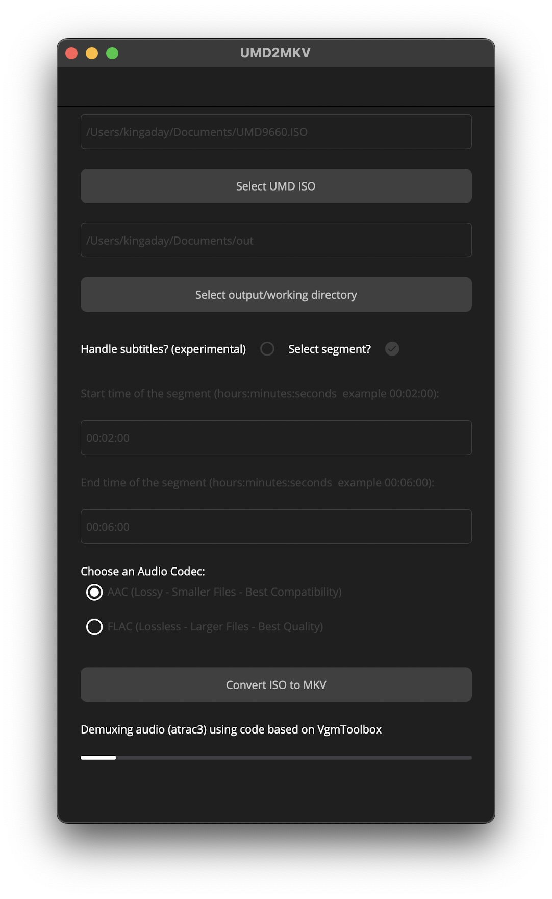

# UMD2MKV (WIP)
## Convert a PSP UMD movie iso file to a MKV file (video,audio,subs)  
  

## Rationale:

Julian, a friend of mine produces comparison videos on youtube exploring the picture quality differences between different home video releases.
You can find his work on : https://www.youtube.com/@JulianDeBacker  
Besides dvds, (4K) blurays, laserdiscs, vhs tapes, ... he also assesses the quality of UMD video releases.
Where possible he tries to use the cleanest copy for this "fair use" purpose so direct digital copies are preferred.
His focus is not on technical processes so this is where UMD2MKV comes into play.
Without the need to know about several tools and technical jargon he can now easily extract scenes from UMD movies.

## Usage:
1. Download the zip release and extract the content. Double click the UMD2MKV executable file.
1. Select an ISO file of the UMD movie you want to convert.
   (You will need access to a PSP with a custom firmware, place your favourite movie in the UMD drive, press the option button and set USB to UMD, connect your psp via USB to your PC and a new drive should pop up containing the ISO)
2. Select an output/working directory. This needs to be an empty folder!
3. If you only want to export a scene or segment of the movie check the "select segment" checkbox and fill in the start and end time. (following the format of hours:minutes:seconds)
4. Choose how you want the audio to be transcoded. ACC for lossy compression, FLAC for lossles.
5. Push the "Convert ISO to MKV button" and wait a few minutes. (on my macbook air m3 it takes approximately 3 minutes for a typical movie)

## Known issues:

1. The UI was thrown together very quickly, will try to improve in later versions.
2. Exporting subtitles is a work in progess.
I am able to export all of the PNG's in the subtitle stream but I'm having issues with finding timing information.
Once this has been tackled the goal is to use OCR on the PNG's and to add standard .srt files in the MKV.
If you currently check the "Handle" subtitles checkbox it will dump the PNG's for each language and attempt to create the timings file.
It will not do any OCR yet but just mux the subtitle files with the paths to the png's in it in stead of the actual text.
All files related to subtitle handling are NOT deleted from the output directory for debugging purposes.
If you can help in making sense of the binary structure of the psp subs files please contact me :)
-->UPDATE : it seems the format IS vobsub ... trying out some code based on subtitleedit (https://github.com/SubtitleEdit/subtitleedit) to deal with the timestamps

## Releases:
Only win X64 release for now. Mac releases will come soon.

## References:
Idea/general process needed to do the conversion coming from:  
https://www.journaldulapin.com/2015/02/12/comment-ripper-un-umd-video/  
https://www.reddit.com/r/PSP/comments/n7t7co/my_quest_to_rip_a_psp_umd_movie/  

Extracting mps stream from UMD iso file using DiscUtils:  
https://github.com/DiscUtils/DiscUtils   

Demuxing audio streams and subtitles based on VGMToolbox code (reduced/cleaned up/modernized):  
https://github.com/Manicsteiner/VGMToolbox  

Extracting PNG files from subtitle files based on:  
https://gist.github.com/rlaphoenix/c2547539f6b35aa7dd33714c43813150  

Encoding audio and muxing by using FFmpeg (through Xabe.Ffmpeg):  
https://github.com/FFmpeg/FFmpeg. 
https://github.com/tomaszzmuda/Xabe.FFmpeg  

